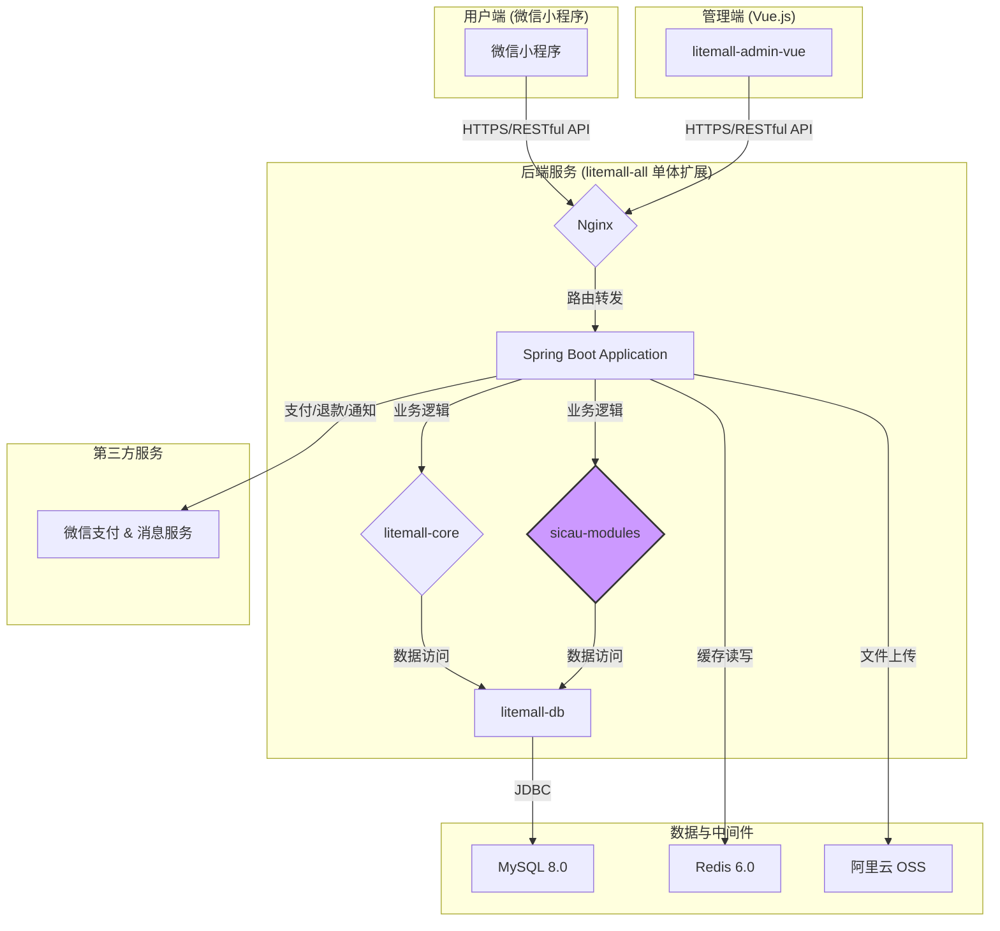
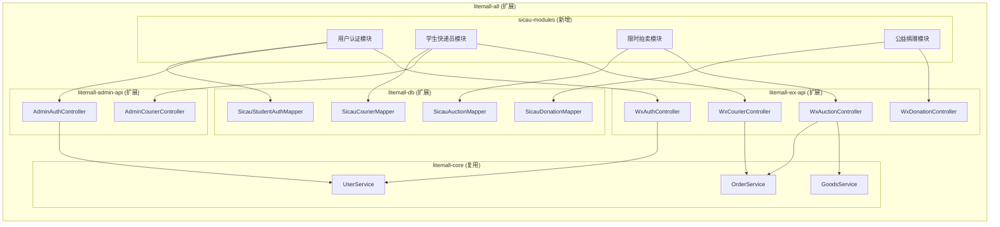
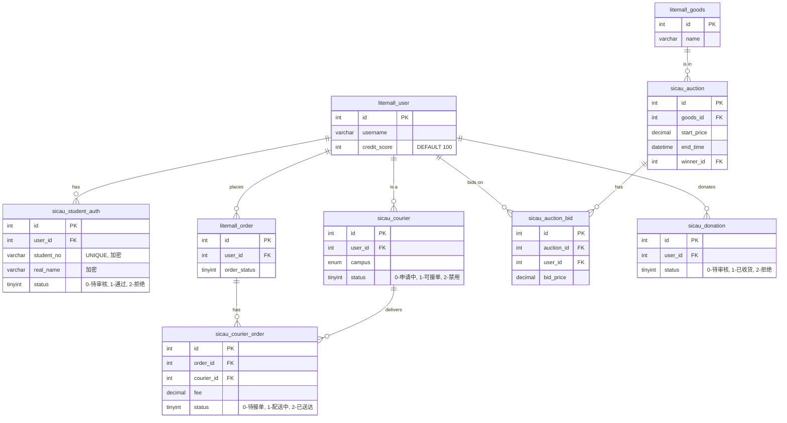

# 四川农业大学校园闲置物品交易系统 架构设计文档

**作者:** Alexa (BMAD Architect)  
**日期:** 2025-10-27  
**版本:** 1.0  
**项目级别:** Level 3 (Brownfield)  
**基础架构:** litemall (Spring Boot 2.1.5 + Vue.js 2.6)

---

## 1. 系统概览

### 1.1 目标

本架构旨在为"四川农业大学校园闲置物品交易系统"提供一个可扩展、安全且高性能的技术蓝图。设计遵循 **渐进式架构演进** 原则，在复用现有 litemall 平台能力的基础上，平滑集成校园特色功能，确保 MVP 阶段的快速交付和长期迭代的灵活性。

### 1.2 整体架构图 (MVP 阶段)



**架构解读:**
- **单体扩展**: MVP 阶段，所有新功能（`sicau-modules`）将作为新模块集成到现有的 `litemall-all` Spring Boot 应用中，以降低部署复杂度和开发成本。
- **前后端分离**: 沿用 litemall 的前后端分离模式，小程序端和管理后台通过 RESTful API 与后端通信。
- **统一数据存储**: 所有业务数据（包括新增的 4 张表）统一存储在同一个 MySQL 数据库实例中。
- **云服务集成**: 图片等静态资源将直接上传至阿里云 OSS，减轻服务器带宽压力。

---

## 2. 模块设计

### 2.1 模块关系图



### 2.2 核心模块职责

| 模块 | 职责 | 关键类/接口 |
|-----|------|-------------|
| **用户认证模块** | 处理学号绑定、实名审核、信用积分计算 | `SicauAuthService`, `CreditScoreCalculator` |
| **学生快递员模块** | 管理快递员申请、接单、配送、结算 | `CourierService`, `CourierOrderScheduler` |
| **限时拍卖模块** | 实现拍卖创建、竞价、保证金、结算逻辑 | `AuctionService`, `AuctionStateMachine` |
| **公益捐赠模块** | 处理捐赠申请、审核、积分奖励 | `DonationService` |
| **litemall-wx-api (扩展)** | 提供面向小程序的新增 API 端点 | `WxCourierController`, `WxAuctionController` |
| **litemall-admin-api (扩展)** | 提供面向管理后台的新增 API 端点 | `AdminAuthController` |

---

## 3. 数据模型

### 3.1 实体关系图 (ER Diagram)



### 3.2 新增数据表结构

**1. `sicau_student_auth`**
```sql
CREATE TABLE `sicau_student_auth` (
  `id` INT PRIMARY KEY AUTO_INCREMENT,
  `user_id` INT NOT NULL COMMENT '关联 litemall_user.id',
  `student_no` VARCHAR(255) NOT NULL COMMENT '学号 (AES 加密)',
  `real_name` VARCHAR(255) NOT NULL COMMENT '真实姓名 (AES 加密)',
  `college` VARCHAR(100) COMMENT '学院',
  `major` VARCHAR(100) COMMENT '专业',
  `student_card_url` VARCHAR(255) COMMENT '学生证照片 URL',
  `status` TINYINT DEFAULT 0 COMMENT '0-待审核, 1-通过, 2-拒绝',
  `create_time` DATETIME DEFAULT CURRENT_TIMESTAMP,
  UNIQUE KEY `uk_user_id` (`user_id`),
  UNIQUE KEY `uk_student_no` (`student_no`)
) COMMENT='学生实名认证表';
```

**2. `sicau_courier`**
```sql
CREATE TABLE `sicau_courier` (
  `id` INT PRIMARY KEY AUTO_INCREMENT,
  `user_id` INT NOT NULL COMMENT '关联 litemall_user.id',
  `dorm_building` VARCHAR(50) COMMENT '宿舍楼栋',
  `campus` ENUM('成都','雅安','都江堰') NOT NULL COMMENT '所在校区',
  `status` TINYINT DEFAULT 0 COMMENT '0-申请中, 1-可接单, 2-禁用',
  `total_orders` INT DEFAULT 0 COMMENT '累计配送单数',
  `total_income` DECIMAL(10,2) DEFAULT 0.00 COMMENT '累计收入',
  `create_time` DATETIME DEFAULT CURRENT_TIMESTAMP,
  UNIQUE KEY `uk_user_id` (`user_id`)
) COMMENT='学生快递员信息表';
```

**3. `sicau_auction`**
```sql
CREATE TABLE `sicau_auction` (
  `id` INT PRIMARY KEY AUTO_INCREMENT,
  `goods_id` INT NOT NULL COMMENT '关联 litemall_goods.id',
  `seller_id` INT NOT NULL COMMENT '卖家 ID',
  `start_price` DECIMAL(10,2) NOT NULL COMMENT '起拍价',
  `current_price` DECIMAL(10,2) COMMENT '当前价格',
  `increment` DECIMAL(10,2) NOT NULL COMMENT '加价幅度',
  `start_time` DATETIME DEFAULT CURRENT_TIMESTAMP,
  `end_time` DATETIME NOT NULL COMMENT '结束时间',
  `winner_id` INT COMMENT '中标用户 ID',
  `status` TINYINT DEFAULT 0 COMMENT '0-进行中, 1-已结束, 2-已成交, 3-流拍',
  UNIQUE KEY `uk_goods_id` (`goods_id`)
) COMMENT='限时拍卖表';
```

**4. `sicau_donation`**
```sql
CREATE TABLE `sicau_donation` (
  `id` INT PRIMARY KEY AUTO_INCREMENT,
  `user_id` INT NOT NULL,
  `goods_desc` TEXT COMMENT '物品描述',
  `category` VARCHAR(50) COMMENT '分类（衣物/文具/书籍）',
  `images` TEXT COMMENT '物品图片 (JSON 数组)',
  `pickup_method` TINYINT COMMENT '0-自送, 1-上门',
  `status` TINYINT DEFAULT 0 COMMENT '0-待审核, 1-待收取, 2-已完成, 3-已拒绝',
  `volunteer_id` INT COMMENT '负责志愿者 ID',
  `create_time` DATETIME DEFAULT CURRENT_TIMESTAMP
) COMMENT='公益捐赠表';
```

---

## 4. 架构决策记录 (ADR)

### ADR-001: 微信支付集成策略
- **背景**: 交易流程需要在线支付，拍卖功能需要保证金机制。
- **决策**: **直接在 `sicau-wx-api` 模块中集成微信支付**。
- **理由**:
    - **快速实现**: MVP 阶段，避免引入新服务带来的复杂性。
    - **成本效益**: 无需额外的服务器资源。
    - **功能匹配**: litemall 已有支付回调处理逻辑，可复用。
- **后果**: 支付逻辑与核心业务耦合，未来若扩展多支付渠道（如支付宝），重构成本较高。
- **未来演进**: 当系统日订单量超过 5000 单或引入新支付渠道时，重构为独立的 `Payment-Service`。

### ADR-002: 学号认证安全机制
- **背景**: 用户身份信息（学号、姓名）是敏感数据，必须安全存储。
- **决策**: **采用 `AES-256-GCM` 对称加密算法对敏感字段进行加密存储**。
- **理由**:
    - **合规性**: 满足个人信息保护法规要求。
    - **安全性**: AES-256 是业界公认的强加密标准，GCM 模式提供认证加密，防篡改。
    - **性能**: 对称加密性能优于非对称加密，满足高并发查询需求。
- **后果**: 数据库中无法直接通过学号进行 `LIKE` 查询，所有查询需在应用层解密后进行。密钥管理成为新的安全关键点。

### ADR-003: 实时消息推送方案
- **背景**: 快递员接单、拍卖出价等场景需要实时通知。
- **决策**: **MVP 阶段采用"微信模板消息 + 前端轮询"的组合方案**。
- **理由**:
    - **可靠性**: 微信模板消息触达率高，适用于关键状态通知。
    - **实现简单**: 前端轮询（如每 30 秒一次）可满足拍卖价格更新等准实时场景，无需引入 WebSocket 等复杂技术。
    - **低成本**: 无需维护长连接服务器。
- **后果**: 轮询会增加服务器无效请求，实时性有延迟。
- **未来演进**: 当日活跃用户超过 5000 人时，引入 WebSocket 或 SSE，为快递员位置实时共享等高级功能做准备。

### ADR-004: 图片存储与 CDN 策略
- **背景**: litemall 默认使用本地存储，无法满足 CDN 加速和服务器扩容需求。
- **决策**: **采用"前端直传阿里云 OSS"方案**。
- **理由**:
    - **性能提升**: 图片不经过应用服务器，减轻带宽压力，上传速度快。
    - **成本优化**: OSS 存储成本远低于服务器磁盘，CDN 加速可降低流量费用。
    - **安全性**: 后端签发临时授权凭证（STS Token），控制上传权限和有效期。
- **后果**: 依赖阿里云服务，增加了系统外部依赖。需要处理前端上传失败的回滚逻辑。

---

## 5. 技术栈

| 领域 | 技术 | 版本 | 备注 |
|-----|------|------|------|
| **后端框架** | Spring Boot | 2.7.x | 从 litemall 2.1.5 升级，以获得更好的性能和安全支持 |
| **数据库** | MySQL | 8.0+ | |
| **缓存** | Redis | 6.0+ | 缓存热门商品、用户信用等级、会话 Token |
| **数据访问** | MyBatis, Druid | | 沿用 litemall 配置 |
| **前端框架** | 微信小程序原生 | | |
| **管理后台** | Vue.js | 2.6.x | 沿用 litemall-admin |
| **对象存储** | 阿里云 OSS | | |
| **JDK** | OpenJDK | 11+ | 升级以支持新版 Spring Boot |
| **构建工具** | Maven | 3.6+ | |

---

## 6. 部署架构

### 6.1 MVP 阶段 (单机部署)
```
┌──────────────────────────┐
│      云服务器 (ECS)      │
│  ┌───────┐  ┌───────┐    │
│  │ Nginx │  │ litemall-all.jar │    │
│  └───────┘  └───────┘    │
│  ┌───────┐  ┌───────┐    │
│  │ MySQL │  │ Redis │    │
│  └───────┘  └───────┘    │
└──────────────────────────┘
```
- **优点**: 部署简单，维护成本低，适合项目初期。
- **缺点**: 单点故障风险，无法水平扩展。

### 6.2 演进阶段 (集群部署)
```
┌──────────────────────────────────────────────────────────┐
│                        负载均衡 (SLB)                      │
└──────────────────────┬──────────────────┬────────────────┘
                       │                  │
┌──────────────────────▼────────┐  ┌──────▼──────────────────┐
│         云服务器 1 (ECS)        │  │         云服务器 2 (ECS)        │
│  ┌───────┐  ┌──────────────┐  │  │  ┌───────┐  ┌──────────────┐  │
│  │ Nginx │  │ litemall-all.jar │  │  │  │ Nginx │  │ litemall-all.jar │  │
│  └───────┘  └──────────────┘  │  │  └───────┘  └──────────────┘  │
└───────────────────────────────┘  └───────────────────────────────┘
                       │                  │
                       └────────┬─────────┘
                                │
┌───────────────────────────────▼───────────────────────────────┐
│                  云数据库 (RDS for MySQL, Redis)              │
└───────────────────────────────────────────────────────────────┘
```
- **优点**: 高可用，可水平扩展应对高并发。
- **演进时机**: 当单机 CPU 负载持续超过 70% 或日活用户超过 1 万时。

---

## 7. 安全架构

| 风险点 | 防护策略 |
|-------|---------|
| **接口裸奔** | **JWT (JSON Web Token)**: 用户登录后签发 Token，后续请求在 Header 中携带 Token 进行鉴权。 |
| **数据泄露** | **AES-256 加密**: 对数据库中的学号、姓名等敏感信息进行加密存储。 |
| **越权访问** | **Shiro 权限控制**: 沿用 litemall 的 Shiro 框架，对管理后台 API 进行精细化的角色权限控制。 |
| **恶意刷接口** | **Redis + Interceptor**: 使用 Redis 记录接口访问频率，通过 Spring MVC 拦截器实现 IP/用户级别的限流。 |
| **SQL 注入** | **MyBatis PreparedStatement**: 使用 `#` 占位符，杜绝 SQL 拼接。 |
| **CSRF/XSS** | **Vue.js 自动防护**: 框架层面提供 XSS 防护。管理后台 API 需增加 CSRF Token 校验。 |

---

**文档状态**: ✅ 已完成  
**下一步**: 进入 **Phase 4: Implementation** 阶段，使用 `sprint-planning` 工作流开始第一个 Sprint。
